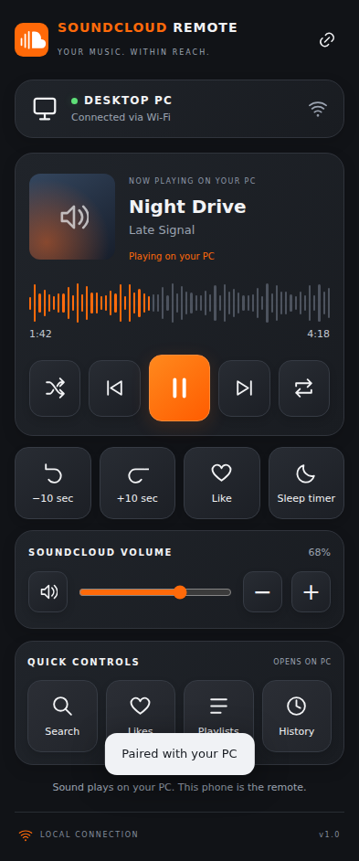

# SoundCloud Wi-Fi Remote

An unofficial Android remote for SoundCloud playing on a Windows PC.

## Downloads

- [Android app — SoundCloud-Remote.apk](SoundCloud-Remote.apk?raw=true)
- [PC companion + complete source code](SoundCloud-Remote-GitHub-Ready.zip?raw=true)

The source ZIP contains the Android project, browser extension, Python helper, UI, tests, build script, and full setup instructions. Extract it before running anything.

## Setup

1. Download the source ZIP above and extract it on your Windows PC.
2. Run **Start-PC.bat** inside the extracted folder. It uses Python 3.10+ if installed, otherwise downloads and verifies the official portable runtime.
3. Open `chrome://extensions` or `edge://extensions`. Enable Developer mode, choose **Load unpacked**, and select the extracted `extension` folder.
4. Open or refresh SoundCloud, start a track, then click the extension and **Connect SoundCloud tab**.
5. Install the APK on Android 9 or newer.
6. Put both devices on the same trusted home network and enter the PC address and pairing code from the helper window.

Keep the PC helper and SoundCloud tab open. See **START-HERE.txt** inside the ZIP for troubleshooting and reset instructions.

## Features

Play/pause, previous/next, seeking, SoundCloud player volume, mute, shuffle/repeat, likes, and a PC-side sleep timer. Search and library shortcuts open on the PC. The waveform is a stylized progress display.

## Build and validation

Complete source and repeatable test scripts are in the source ZIP. Android builds use SDK platform 35, build-tools 35.0.0, JDK 17, and `android/build.sh`. Signing keys are excluded; rebuilding generates your own development key.

APK compilation/signature verification, relay integration tests and simulated UI/adapter tests passed. Physical Android/Windows installation and live end-to-end playback have not been verified. Future SoundCloud site changes may require updating the extension.

## Privacy

No SoundCloud password is collected. The app uses a pairing token over local HTTP; use a trusted home network and do not expose its port to the internet. Album artwork may load directly from SoundCloud. No analytics or cloud relay.

Not affiliated with SoundCloud.
